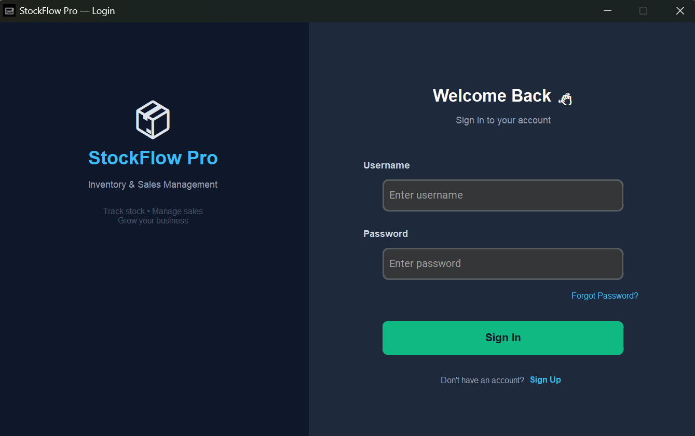
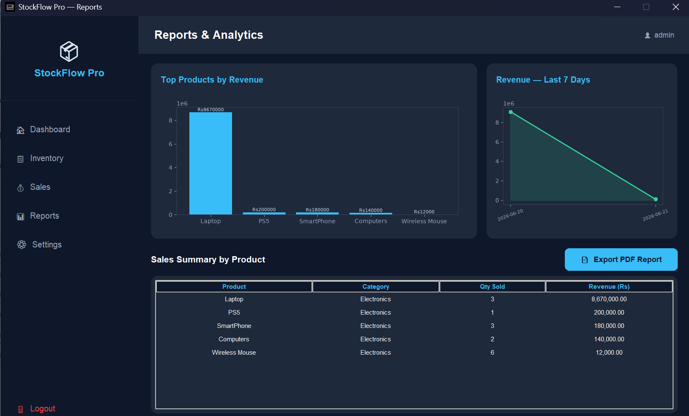
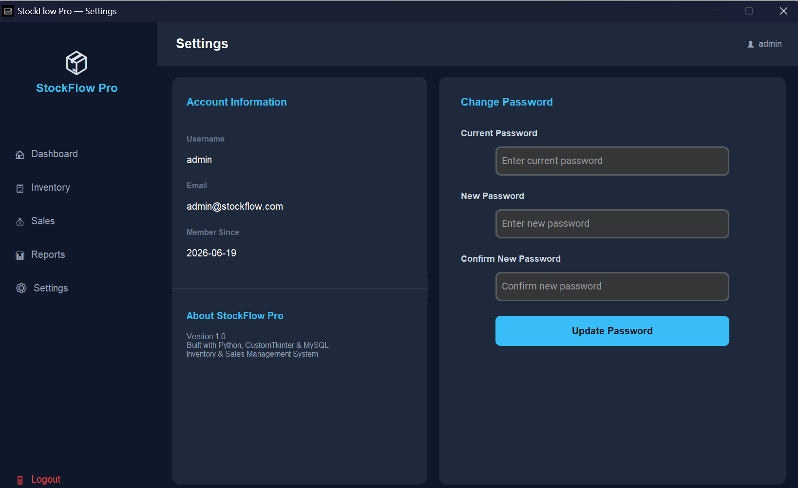

# StockFlow Pro 📦

A professional desktop **Inventory & Sales Management System** built with Python, CustomTkinter, and MySQL — designed for small businesses, retail shops, and pharmacies to track stock, manage sales, and generate reports.

---

## ✨ Features

- **Secure Login** — Session-based authentication with a Forgot Password / reset flow
- **Inventory Management** — Add, update, delete, and search products in real time
- **Sales Recording** — Record sales with auto stock deduction and live total calculation
- **Dashboard** — At-a-glance stats: total products, total stock, low-stock alerts, and stock value
- **Reports & Analytics** — Visual charts (top products by revenue, 7-day revenue trend) plus a full sales summary table
- **PDF Export** — One-click export of the sales report as a polished, printable PDF
- **Modern UI** — Dark-themed, professional interface built with CustomTkinter

---

## 🛠️ Tech Stack

| Layer | Technology |
|---|---|
| Language | Python 3.13 |
| UI Framework | CustomTkinter |
| Database | MySQL 8.0 |
| DB Connector | mysql-connector-python |
| Charts | Matplotlib |
| PDF Generation | ReportLab |

---

## 📁 Project Structure

```
StockFlowPro/
├── main.py              # App entry point
├── config.py            # Database credentials
├── database.py          # All database operations
├── splash_screen.py     # Loading screen
├── login.py             # Login form
├── forgot_password.py   # Password reset form
├── dashboard.py         # Main dashboard with stats
├── inventory.py         # Add / Edit / Delete / Search products
├── sales.py             # Record sales, sales history
└── reports.py           # Charts, sales summary, PDF export
```

---

## ⚙️ Setup Instructions

### 1. Install dependencies
```bash
pip install customtkinter mysql-connector-python pillow matplotlib reportlab
```

### 2. Create the MySQL database
```sql
CREATE DATABASE inventory_db;
USE inventory_db;

CREATE TABLE users (
    id INT AUTO_INCREMENT PRIMARY KEY,
    username VARCHAR(50) NOT NULL UNIQUE,
    password VARCHAR(255) NOT NULL,
    email VARCHAR(100),
    created_at TIMESTAMP DEFAULT CURRENT_TIMESTAMP
);

CREATE TABLE products (
    id INT AUTO_INCREMENT PRIMARY KEY,
    name VARCHAR(100) NOT NULL,
    category VARCHAR(50),
    quantity INT DEFAULT 0,
    price DECIMAL(10,2) NOT NULL,
    supplier VARCHAR(100),
    created_at TIMESTAMP DEFAULT CURRENT_TIMESTAMP
);

CREATE TABLE sales (
    id INT AUTO_INCREMENT PRIMARY KEY,
    product_id INT,
    quantity_sold INT,
    total_price DECIMAL(10,2),
    sale_date TIMESTAMP DEFAULT CURRENT_TIMESTAMP,
    FOREIGN KEY (product_id) REFERENCES products(id)
);

INSERT INTO users (username, password, email)
VALUES ('admin', 'admin123', 'admin@stockflow.com');
```

### 3. Configure your database credentials
Edit `config.py` with your MySQL username/password:
```python
DB_CONFIG = {
    "host": "localhost",
    "user": "root",
    "password": "YOUR_PASSWORD",
    "database": "inventory_db"
}
```

### 4. Run the app
```bash
python main.py
```

**Default login:** `admin` / `admin123`

---

## 📸 Screenshots

**Login**


**Dashboard**


**Inventory Management**


**Sales**


**Reports & Analytics**


**Settings**


---

## 🚀 Roadmap / Planned Improvements

- [ ] Password hashing (bcrypt) for stored credentials
- [ ] Packaged `.exe` for installation without Python
- [ ] Multi-user roles (admin / cashier)
- [ ] Invoice printing per individual sale

---

## 👤 Author

Built by **[ Muhammad Anas ]** — available for freelance desktop application development (inventory systems, POS systems, custom business tools).