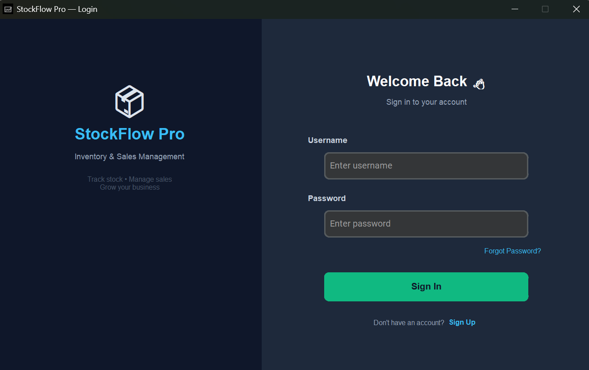
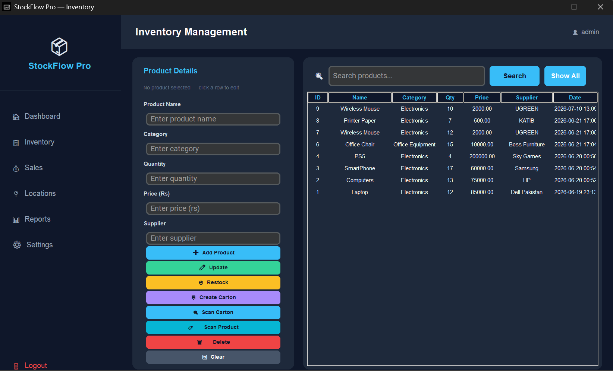
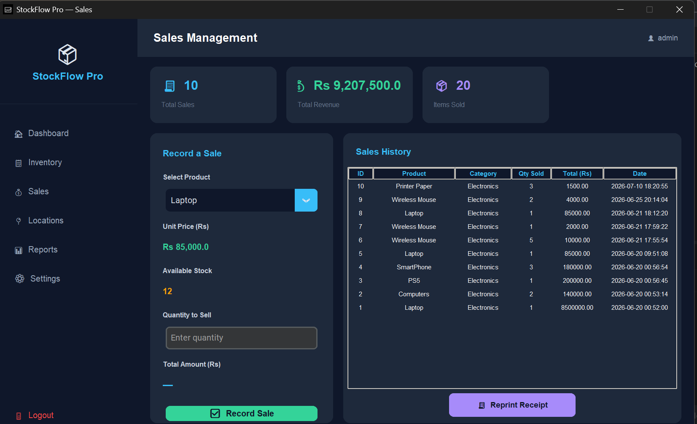
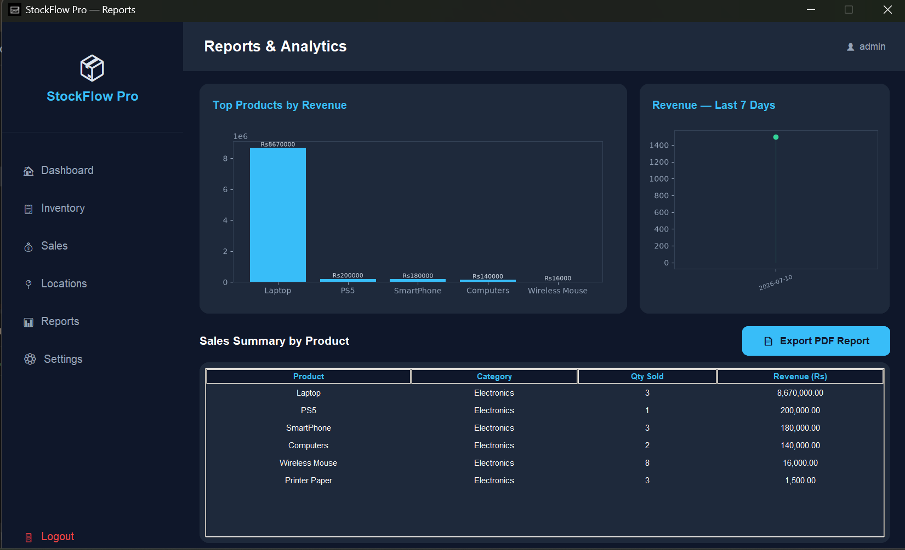
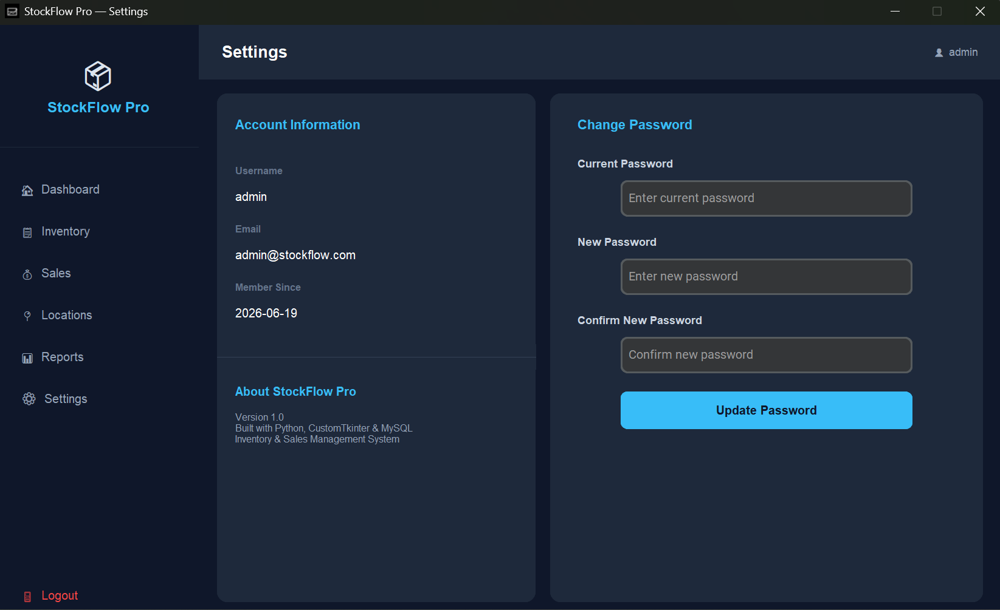

# StockFlow Pro 📦

A professional desktop **Inventory, Sales & Warehouse Management System** built with Python, CustomTkinter, and MySQL — designed for retail shops, pharmacies, and warehouse-based businesses to track stock, manage sales, trace inventory movement, and generate reports.

---

## ✨ Features

### Core Inventory & Sales
- **Secure Login** — Session-based authentication with bcrypt password hashing and a Forgot Password / reset flow
- **Inventory Management** — Add, update, delete, and search products in real time
- **Sales Recording** — Record sales with auto stock deduction and live total calculation
- **Dashboard** — At-a-glance stats: total products, total stock, low-stock alerts, and stock value
- **Reports & Analytics** — Visual charts (top products by revenue, 7-day revenue trend) plus a full sales summary table
- **PDF Export** — One-click export of sales reports and receipts as polished, printable PDFs
- **Modern UI** — Dark-themed, professional interface built with CustomTkinter

### Warehouse & Barcode Tracking
- **Per-SKU Barcodes** — Auto-generated Code128 barcodes, permanently tied to each product's SKU
- **Carton-Level Barcodes** — Each carton gets its own barcode with a configurable units-per-carton value, so scanning one carton updates stock by the correct multiple (not just by one)
- **Location Management** — Track inventory across warehouse zones, containers, and storage areas
- **Movement Audit Trail** — Full scan history per carton (received → stored → opened) with timestamps
- **Automatic Stock Updates** — Quantities update instantly the moment a carton is scanned as received
- **Duplicate-Safe Restocking** — Dedicated restock flow prevents duplicate SKU entries

### Security & Deployment
- Parameterized SQL queries throughout to prevent SQL injection
- Foreign-key-enforced relational data integrity
- Packaged into a standalone Windows `.exe` — no Python installation required to run

---

## 🛠️ Tech Stack

| Layer | Technology |
|---|---|
| Language | Python 3.13 |
| UI Framework | CustomTkinter |
| Database | MySQL 8.0 |
| DB Connector | mysql-connector-python |
| Charts | Matplotlib |
| PDF Generation | ReportLab |
| Barcodes | Code128 (python-barcode / treepoem, etc.) |
| Password Hashing | bcrypt |
| Packaging | PyInstaller (standalone `.exe`) |

---

## 📁 Project Structure

```
StockFlowPro/
├── main.py               # App entry point
├── config.py              # Database credentials
├── database.py            # All database operations
├── splash_screen.py       # Loading screen
├── login.py               # Login form
├── forgot_password.py     # Password reset form
├── dashboard.py           # Main dashboard with stats
├── inventory.py           # Add / Edit / Delete / Search products
├── sales.py               # Record sales, sales history
├── reports.py             # Charts, sales summary, PDF export
├── barcode_generator.py   # SKU & carton barcode generation
├── warehouse.py           # Location management & carton scanning
└── movement_log.py        # Received → stored → opened audit trail
```

---

## ⚙️ Setup Instructions

### 1. Install dependencies
```bash
pip install customtkinter mysql-connector-python pillow matplotlib reportlab bcrypt python-barcode
```

### 2. Create the MySQL database
```sql
CREATE DATABASE inventory_db;
USE inventory_db;

CREATE TABLE users (
    id INT AUTO_INCREMENT PRIMARY KEY,
    username VARCHAR(50) NOT NULL UNIQUE,
    password VARCHAR(255) NOT NULL,
    email VARCHAR(100),
    created_at TIMESTAMP DEFAULT CURRENT_TIMESTAMP
);

CREATE TABLE products (
    id INT AUTO_INCREMENT PRIMARY KEY,
    sku VARCHAR(50) NOT NULL UNIQUE,
    name VARCHAR(100) NOT NULL,
    category VARCHAR(50),
    quantity INT DEFAULT 0,
    price DECIMAL(10,2) NOT NULL,
    supplier VARCHAR(100),
    units_per_carton INT DEFAULT 1,
    created_at TIMESTAMP DEFAULT CURRENT_TIMESTAMP
);

CREATE TABLE sales (
    id INT AUTO_INCREMENT PRIMARY KEY,
    product_id INT,
    quantity_sold INT,
    total_price DECIMAL(10,2),
    sale_date TIMESTAMP DEFAULT CURRENT_TIMESTAMP,
    FOREIGN KEY (product_id) REFERENCES products(id)
);

CREATE TABLE locations (
    id INT AUTO_INCREMENT PRIMARY KEY,
    name VARCHAR(100) NOT NULL,
    zone VARCHAR(50),
    created_at TIMESTAMP DEFAULT CURRENT_TIMESTAMP
);

CREATE TABLE cartons (
    id INT AUTO_INCREMENT PRIMARY KEY,
    carton_barcode VARCHAR(100) NOT NULL UNIQUE,
    product_id INT,
    location_id INT,
    status ENUM('received', 'stored', 'opened') DEFAULT 'received',
    created_at TIMESTAMP DEFAULT CURRENT_TIMESTAMP,
    FOREIGN KEY (product_id) REFERENCES products(id),
    FOREIGN KEY (location_id) REFERENCES locations(id)
);

CREATE TABLE movement_log (
    id INT AUTO_INCREMENT PRIMARY KEY,
    carton_id INT,
    status ENUM('received', 'stored', 'opened') NOT NULL,
    scanned_at TIMESTAMP DEFAULT CURRENT_TIMESTAMP,
    FOREIGN KEY (carton_id) REFERENCES cartons(id)
);

INSERT INTO users (username, password, email)
VALUES ('admin', '$2b$12$REPLACE_WITH_BCRYPT_HASH', 'admin@stockflow.com');
```

> ⚠️ Passwords are stored as bcrypt hashes — don't insert plain text. Generate a hash with `bcrypt.hashpw()` before inserting your admin user.

### 3. Configure your database credentials
Edit `config.py` with your MySQL username/password:
```python
DB_CONFIG = {
    "host": "localhost",
    "user": "root",
    "password": "YOUR_PASSWORD",
    "database": "inventory_db"
}
```

### 4. Run the app
```bash
python main.py
```

**Default login:** `admin` / `admin123` *(change immediately after first login)*

---

## 📸 Screenshots

**Login**


**Dashboard**


**Inventory Management**


**Sales**


**Reports & Analytics**


**Warehouse & Barcode Tracking**


**Settings**


---

## 🚀 Roadmap / Planned Improvements

- [ ] Multi-user roles (admin / cashier / warehouse staff)
- [ ] Invoice printing per individual sale
- [ ] "Scan location once, then scan multiple cartons" batch-receiving flow
- [ ] Optional item-level barcodes for high-value SKUs
- [ ] Mobile/handheld scanner support

---

## 👤 Author

Built by **[ Muhammad Anas ]** — available for freelance desktop application development (inventory systems, POS systems, warehouse & barcode tracking systems, custom business tools).